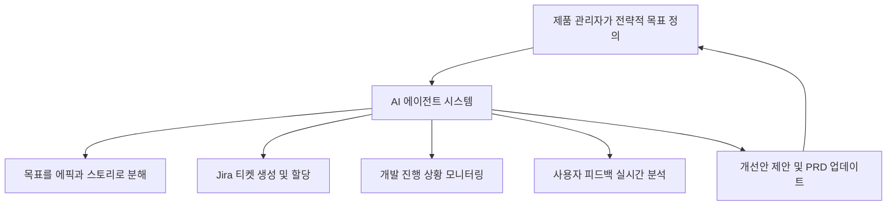

# 증강된 PRD: AI 기반 제품 요구사항 문서 작성을 위한 종합 가이드

## 현대의 PRD: 애자일 시대의 전략적 나침반

### PRD의 재정의: 정적 설계도에서 살아있는 문서로

제품 요구사항 문서(Product Requirements Document, PRD)는 전통적으로 특정 제품의 목적, 기능, 동작 방식 등 모든 요구사항을 정의하는 핵심 산출물로 인식되어 왔습니다. 이 문서는 비즈니스팀과 기술팀 모두에게 제품을 구축, 출시, 마케팅하는 데 필요한 지침을 제공하는 나침반 역할을 수행합니다.

> 전통적 PRD vs 현대적 PRD
> 
> 
> 과거 폭포수(waterfall) 개발 방법론에서 PRD는 개발 시작 전에 모든 요구사항을 확정하는 정적인 설계도에 가까웠습니다. 그러나 오늘날의 애자일(Agile) 개발 환경에서는 "살아있는 문서(living document)"로서 제품의 생명주기에 따라 지속적으로 업데이트되고 발전합니다.
> 

**애자일 환경에서 성공적인 PRD의 핵심 역할:**

- **이해관계자 정렬**: 프로젝트 초기에 모든 이해관계자의 의견을 수렴하고 공통된 이해 형성
- **범위 명확화**: 프로젝트의 scope를 명확히 하고 핵심 목표에 집중
- **혼란 방지**: 명확하지 않은 기대로 인해 발생하는 재작업 최소화

### AI가 조율하는 지식 허브로서의 PRD

AI는 PRD를 단순한 '문서'에서 역동적이고 상호 연결된 '지식 허브'로 진화시킵니다.

**AI 활용 PRD의 새로운 패러다임:**

| 전통적 접근 | AI 기반 접근 |
| --- | --- |
| 수동적 정보 저장소 | 활성 데이터셋(active dataset) |
| 정적인 템플릿 문서 | 지속적으로 업데이트되는 살아있는 문서 |
| 개별 작업의 집합 | 통합된 제품 관리 생태계 |

---

## 고성과 PRD의 구성 요소

### 핵심 구성 요소별 AI 증강

| 구성 요소 | 목적 | 전통적 방식의 어려움 | AI 증강 |
| --- | --- | --- | --- |
| **프로젝트 개요 및 배경** | 제품/기능의 목적, 목표 사용자, 전략적 맥락을 요약하여 모든 이해관계자가 '왜'를 이해하도록 함 | 배경 정보 수집 및 전략적 연관성 설명에 많은 시간이 소요되며, 종종 주관적인 해석에 의존함 | 관련 시장 분석, 경쟁사 동향, 내부 데이터를 종합하여 설득력 있는 배경과 전략적 적합성에 대한 초안을 신속하게 생성 |
| **비즈니스 목표 및 성공 지표** | 제품의 성공을 측정할 수 있는 명확한 KPI를 정의하여, 팀의 노력이 비즈니스 가치와 직결되도록 보장함 | 의미 있고 측정 가능한 지표를 정의하기 어려우며, 산업 표준이나 데이터 기반 근거가 부족한 경우가 많음 | HEART, AARRR과 같은 프레임워크를 기반으로 제품 목표에 맞는 KPI를 추천하고, 각 지표에 대한 구체적인 측정 방안을 제안 |
| **대상 페르소나 및 사용자 스토리** | 목표 사용자를 구체화하고, 그들의 요구사항을 '사용자 스토리' 형식으로 명확하게 기술하여 사용자 중심 개발을 유도함 | 사용자 인터뷰, 설문조사 등 방대한 정성적 데이터를 수동으로 분석하고 종합하는 데 시간이 많이 걸리고 편향이 발생하기 쉬움 | 수천 개의 사용자 피드백, 인터뷰 녹취록, 지원 티켓을 분석하여 데이터 기반 페르소나를 생성하고, 이를 바탕으로 구조화된 사용자 스토리를 대량으로 작성 |
| **기능적/비기능적 요구사항** | 제품이 수행해야 할 구체적인 기능(functional)과 성능, 보안, 안정성 등 품질 속성(non-functional)을 명시함 | 비기능적 요구사항(NFR)은 종종 간과되거나 모호하게 정의되어 프로젝트 후반에 큰 문제를 야기함 | 제품 유형과 산업 표준(예: ISO/IEC 25010)을 기반으로 필수적인 비기능적 요구사항 목록을 생성하고, 각 항목을 테스트 가능한 형태로 구체화 |
| **사용자 인터랙션 및 디자인** | 와이어프레임, 목업, 사용자 플로우 다이어그램 등을 통해 사용자 경험(UX)을 시각적으로 구체화하고 팀의 이해를 도움 | 아이디어를 시각화하는 데 많은 시간과 디자인 전문성이 필요하며, 초기 단계에서 다양한 대안을 탐색하기 어려움 | 텍스트 프롬프트나 사용자 스토리 목록으로부터 사용자 플로우 다이어그램과 로우파이(low-fidelity) 와이어프레임을 자동으로 생성하여 신속한 아이디어 검증을 지원 |
| **범위 제외 사항 (Out of Scope)** | 현재 릴리스에서 '하지 않을 것'을 명확히 정의하여 팀이 핵심 작업에 집중하고 범위확장(scope creep)을 방지함 | 이해관계자들의 다양한 요구 속에서 '하지 않을 것'을 결정하고 명시하는 것이 정치적으로 민감하고 어려울 수 있음 | 제안된 기능 목록과 현재 목표를 비교 분석하여 우선순위가 낮거나 전략적 연관성이 떨어지는 항목을 식별하고, 범위 제외 근거를 논리적으로 제시 |
| **미결정 이슈 및 질문** | 프로젝트 진행 중 해결해야 할 질문이나 연구가 필요한 항목을 추적하여 불확실성을 관리하고 의사결정을 촉진함 | 미결정 사항들이 여러 채널에 흩어져 추적이 어렵고, 논의 과정에서 누락되기 쉬움 | 회의록, 슬랙 대화 등을 분석하여 미결정된 의사결정 사항이나 잠재적 리스크를 자동으로 식별하고 목록화하여 추적을 용이하게 함 |

---

## AI 부조종사: PRD 구성요소 생성을 위한 단계별 가이드

### 데이터 기반 사용자 페르소나 제작

### 실행 단계

1. **데이터 수집**: 페르소나 생성에 사용할 원시 데이터 준비
    - 사용자 인터뷰 녹취록
    - 설문조사 응답
    - 고객 지원 대화 로그
2. **종합을 위한 프롬프트 작성**

```
다음의 [사용자 인터뷰 녹취록 10개]를 분석하여, 사용자의 공통적인 목표,
가장 큰 불만 사항(pain points), 그리고 제품 사용 동기와 관련된 핵심 테마를
식별해 줘. 이 테마들을 바탕으로, 우리의 [제품명]을 위한 3개의 뚜렷하게
구분되는 사용자 페르소나를 생성해 줘.

각 페르소나에 대해 다음 항목을 포함해 줘:
- 이름과 가상의 사진 설명
- 인구통계학적 정보 (직책, 소속 산업, 회사 규모, 기술 숙련도)
- 핵심 목표 (Goals)
- 주요 불만 사항 (Frustrations)
- 이 페르소나의 하루를 설명하는 짧은 서사 (Narrative)
- 우리 제품과 관련하여 이 페르소나가 할 법한 인용문 (Quote)

```

1. **인간의 검토 및 보완**
    - 도메인 지식과 공감 능력을 활용한 검증
    - 깊이 있는 통찰과 감정적 뉘앙스 추가

### 문제 정의에서 실행 가능한 사용자 스토리로

### 사용자 스토리 표준 형식

> "나는 [페르소나]로서, [혜택]을 얻기 위해, [기능]을 원한다"
(As a [persona], I want to [action], so that [benefit])
> 

### 프롬프트 예시

```
당신은 숙련된 애자일 제품 책임자(Product Owner)입니다.
다음 정보를 바탕으로 사용자 스토리를 생성해 주세요.

- 사용자 페르소나: '신규 사용자 올리비아'. 그녀는 기술에 익숙하지만
  우리 앱의 복잡한 가입 절차 때문에 좌절감을 느끼고 이탈할 가능성이 높다.
- 에픽(Epic): '사용자 온보딩 경험 간소화'
- 목표: 신규 사용자의 가입 완료율을 20% 향상시킨다.

위 정보를 바탕으로, '사용자 온보딩 경험 간소화' 에픽에 포함될
사용자 스토리 5~7개를 생성해 줘. 각 스토리는 반드시
"As a..., I want..., so that..." 형식을 따라야 하며,
INVEST 원칙(Independent, Negotiable, Valuable, Estimable,
Small, Testable)을 최대한 준수하도록 작성해 줘.

```

### 정밀한 성공 정의: AI 기반 지표 및 KPI 제안

### HEART 프레임워크 기반 KPI 생성

```
우리 SaaS 제품의 목표는 '사용자 유지율(retention) 개선'이다.
구글의 HEART 프레임워크를 사용하여, 이 목표를 측정하기 위한
구체적이고 측정 가능한 KPI를 제안해 줘.

특히 '유지(Retention)'와 '참여(Engagement)' 카테고리에 초점을 맞춰
각각 2~3개의 KPI를 제안해 줘. 각 KPI에 대해, 그것을 측정하기 위한
'신호(Signal)'와 구체적인 '지표(Metric)'를 다음과 같은 형식으로 정의해 줘.

- 카테고리: [예: 유지]
- 목표: [예: 사용자가 우리 제품을 계속 사용하도록 장려]
- 신호: [예: 사용자가 정기적으로 앱에 다시 방문함]
- 지표: [구체적인 측정 방법]

```

### 명확성 확보를 위한 인수 조건(Acceptance Criteria) 작성

### 거킨(Gherkin) 형식 AC 생성

```
다음 사용자 스토리에 대한 인수 조건을 거킨(Gherkin)의
'Given-When-Then' 형식으로 생성해 줘.

사용자 스토리: "나는 등록된 사용자로서, 내 계정에 다시 접근하기 위해
비밀번호를 재설정하고 싶다."

다음 시나리오들을 반드시 포함해 줘:
1. 성공적인 비밀번호 재설정 (유효한 이메일 입력 및 재설정 링크 클릭)
2. 존재하지 않는 이메일 주소 입력
3. 비밀번호 재설정 토큰이 만료된 경우
4. 새 비밀번호가 보안 정책(예: 최소 8자, 특수문자 포함)을 충족하지 못하는 경우

```

### 경험의 시각화: 사용자 플로우 및 와이어프레임 생성

### 사용자 플로우 생성

```
온라인 쇼핑몰의 결제 프로세스에 대한 사용자 플로우 다이어그램을
Mermaid.js 구문으로 생성해 줘. 플로우는 '사용자가 장바구니에 상품 추가'에서
시작하여 다음 단계를 포함해야 한다:

- 장바구니 보기
- 배송 정보 입력
- 결제 정보 입력
- 주문 확인 및 완료

'결제 성공 여부'에 대한 결정 지점(decision point)을 포함하고,
성공과 실패 경로를 각각 명시해 줘.

```

### 보이지 않는 것의 명시: 비기능적 요구사항(NFRs) 식별

### NFR 생성 프롬프트

```
나는 사용자가 진료 예약을 하고 의료 기록을 조회할 수 있는
헬스케어 모바일 앱을 구축하고 있다. 이 앱은 미국의 HIPAA
(건강 보험 양도 및 책임에 관한 법) 규정을 준수해야 한다.

ISO/IEC 25010 표준과 HIPAA 규정을 기반으로,
다음 카테고리에서 필수적인 비기능적 요구사항 목록을 생성해 줘:

- 보안(Security): 데이터 암호화, 접근 제어 등
- 성능(Performance): 응답 시간, 동시 접속자 수 등
- 신뢰성(Reliability): 시스템 가동 시간(uptime), 오류 복구 등

각 요구사항은 구체적이고 테스트 가능한 형태로 제시해 줘.
(예: '모든 사용자 데이터는 전송 중 및 저장 시 AES-256
암호화 표준을 사용해야 한다.')

```

---

## 기술의 완성: 제품 관리자를 위한 고급 프롬프트 엔지니어링

### 효과적인 프롬프트의 기초

### 핵심 원칙

**1. 역할 할당 (페르소나 패턴)**

```
"당신은 B2B SaaS 분야에서 20년 경력을 가진 최고의 제품 관리자입니다..."

```

**2. 맥락 제공 (도메인 프라이밍)**

- 회사 정보
- 제품 설명
- 목표 사용자
- 경쟁 환경

**3. 퓨샷 프롬프팅 (Few-Shot Prompting)**

- 원하는 결과물의 예시 제공
- 스타일, 구조, 톤 명확화

**4. 사고의 사슬 (Chain-of-Thought)**

```
"먼저 시장을 분석하고, 그 다음 타겟 고객을 정의하고,
마지막으로 기능 목록을 제안해 줘."

```

### 제품 관리자 프롬프트 라이브러리

| 작업 | 프롬프트 템플릿 | 핵심 변수 | 기대 결과물 |
| --- | --- | --- | --- |
| **경쟁사 분석 요약** | 당신은 뛰어난 제품 전략가입니다. 경쟁사인 [경쟁사 이름]에 대한 다음 [사용자 리뷰 데이터 또는 기사 링크]를 분석해 주세요. 사용자들이 언급한 상위 3가지 강점과 상위 3가지 약점을 요약해 주세요. 또한, 우리 제품 [우리 제품 이름]에게 시장 기회가 될 수 있는 반복적인 기능 요청 사항을 식별해 주세요. | `[경쟁사 이름]`, `[사용자 리뷰 데이터]`, `[우리 제품 이름]` | 경쟁사의 강점, 약점, 시장 기회에 대한 구조화된 요약 보고서 |
| **PRD 개요 초안 작성** | 당신은 제품 관리자입니다. 다음 [문제 정의]와 타겟 페르소나 [페르소나 상세 정보]를 바탕으로, PRD의 '개요' 섹션과 '배경 및 전략적 적합성' 섹션의 설득력 있는 초안을 작성해 주세요. | `[문제 정의]`, `[페르소나 상세 정보]`, `[회사 전체 목표]` | PRD의 도입부로 사용할 수 있는 문단 |
| **기능 아이디어 브레인스토밍** | [우리 제품]은 [제품 설명]입니다. 우리 제품의 핵심 목표는 [제품 목표]입니다. 이 목표 달성에 기여할 수 있는 혁신적인 기능 아이디어 5가지를 브레인스토밍해 주세요. | `[우리 제품]`, `[제품 설명]`, `[제품 목표]` | 새로운 기능 아이디어 목록과 설명 |
| **사용자 인터뷰 질문 생성** | 우리는 [제품/기능 이름]에 대한 사용자 경험을 이해하기 위해 인터뷰를 계획하고 있습니다. 인터뷰 대상은 [타겟 사용자 그룹]입니다. | `[제품/기능 이름]`, `[타겟 사용자 그룹]` | 구조화된 인터뷰 질문 목록 |
| **출시 계획 초안 작성** | 우리는 [기능 이름]을 [목표 출시일]에 출시할 계획입니다. GTM 전략의 주요 구성 요소를 포함하는 출시 계획 초안을 작성해 주세요. | `[기능 이름]`, `[목표 출시일]` | 포괄적인 출시 계획 문서 |

---

## AI 네이티브 워크플로우: 도구, 통합, 그리고 자동화

### 현대 PM의 툴킷: AI 기반 플랫폼 비교 분석

| 도구 | 주요 AI 기능 | 강점 | 한계점 | 이상적인 사용 사례 |
| --- | --- | --- | --- | --- |
| **ChatPRD** | PRD 및 관련 문서 자동 생성 | • 간단한 아이디어 입력으로 완전한 PRD 초안 생성<br>• 제품 관리 용어 및 구조에 대한 깊은 이해<br>• 글쓰기 시간을 시간 단위에서 분 단위로 단축 | • 로드맵 관리나 피드백 분석 등 종합 PM 기능은 제한적<br>• 독립 실행형 도구로 기존 플랫폼과의 깊은 통합은 별도 설정 필요 | 신속한 문서 작성이 최우선 과제인 스타트업 또는 소규모 팀 |
| **Notion AI** | 문서 내 콘텐츠 생성, 요약, 번역 | • 기존 지식 베이스 및 문서와 완벽하게 통합<br>• 매우 유연한 템플릿과 데이터베이스 기능<br>• 회의록 요약, 액션 아이템 추출 등 범용적 활용성 | • 제품 관리 전문 기능 부족<br>• AI 기능이 문서 내 텍스트 처리에 집중됨 | 문서 중심의 워크플로우를 가진 팀 |
| **Productboard AI** | 사용자 피드백 분석 및 로드맵 우선순위 제안 | • 여러 채널의 피드백을 AI로 자동 분류 및 테마 분석<br>• 피드백 기반 기능 영향력 점수화<br>• 데이터 기반 객관적 우선순위 결정 지원 | • PRD나 사용자 스토리 작성 기능 약함<br>• 높은 가격대 | 대량의 고객 피드백을 체계적으로 관리해야 하는 중대규모 조직 |
| **Aha!** | 릴리스 노트 초안 작성, 전략적 텍스트 생성 | • 제품 전략 및 로드맵과 AI 기능 긴밀 연결<br>• 목표 기반 글쓰기 지원<br>• 엔터프라이즈급 포괄적 제품 관리 기능 | • AI 기능이 글쓰기 보조에 집중<br>• 높은 학습 곡선 | 명확한 제품 전략 하에 로드맵을 관리하는 대규모 조직 |
| **ClickUp AI** | 작업 자동화 및 프로젝트 관리 보조 | • 프로젝트 관리 워크플로우 내 AI 직접 활용<br>• 종속성 분석 및 병목 현상 예측<br>• 1,000개 이상 도구와 통합 | • 상위 수준 PM 작업 지원 미흡<br>• 실행 단계에 초점 | 복잡한 프로젝트를 관리하고 실행 효율성을 극대화하려는 팀 |

### 문서에서 행동으로: Jira 티켓 생성 및 백로그 그루밍 자동화

### 워크플로우 예시

1. **PRD 완성**
    - ChatPRD나 Notion에서 AI의 도움을 받아 PRD 섹션 완성
2. **자동 티켓 생성**
    
    ```
    "이 PRD의 '사용자 인증' 섹션을 분석해 줘.
    각 사용자 스토리에 대해, 스토리를 제목으로 하고
    인수 조건을 설명란에 포함하는 Jira 티켓을 생성해 줘.
    그리고 모든 티켓을 '백엔드' 에픽에 할당해 줘."
    
    ```
    
3. **백로그 그루밍**
    - AI 에이전트가 중복 스토리 식별
    - 관련 작업 병합 제안
    - 과거 데이터 기반 공수 추정

### 피드백 루프 완성

### 릴리스 노트 자동 생성

- 완료된 사용자 스토리/기능 목록 스캔
- 목표 청중에 맞춰 톤과 스타일 조절
- 고객 전달용 릴리스 노트 초안 작성

### A/B 테스트 아이디어 생성

```
"이 PRD에 기술된 '개인화 추천' 기능을 기반으로,
사용자 참여도에 미치는 영향을 검증하기 위한
A/B 테스트 가설 3개를 생성해 줘.

각 가설에 대해 다음을 명시해 줘:
- 대조군(control)
- 실험군(variation)
- 측정할 주요 KPI"

```

### '에이전트 기반(Agentic)' 제품 워크플로우의 부상

**미래의 자동화된 제품 개발 엔진:**



---

## AI 시대의 전략적 리더십: 거버넌스, 검증, 그리고 제품 팀의 미래

### 신뢰하되, 검증하라: AI 생성 요구사항 검증 프레임워크

### 검증 체크리스트

**전략적 정렬 (Strategic Alignment)**

- [ ]  제품 비전과 일치하는가?
- [ ]  상위 비즈니스 목표와 부합하는가?

**사용자 가치 (User Value)**

- [ ]  진정으로 사용자 문제를 해결하는가?
- [ ]  실제 사용자 피드백과 일치하는가?

**완전성 및 명확성 (BABOK 원칙)**

- [ ]  원자적(Atomic)인가?
- [ ]  완전(Complete)한가?
- [ ]  일관(Consistent)된가?
- [ ]  모호하지 않은가(Unambiguous)?
- [ ]  테스트 가능한가(Testable)?

**실현 가능성 (Feasibility)**

- [ ]  기술적으로 구현 가능한가?
- [ ]  시간과 리소스 내에서 합리적인가?

### 인간 참여형 루프의 필요성: 편향 완화 및 윤리적 감독

### 제품 관리자가 경계해야 할 주요 편향

| 편향 유형 | 설명 | 대응 방안 |
| --- | --- | --- |
| **선택 편향** | 학습 데이터가 실제 사용자 집단을 대표하지 않음 | 데이터 소스의 다양성 확보 |
| **확증 편향** | 기존 신념을 확인하는 결과만 선택적 수용 | 객관적인 검증 프로세스 구축 |
| **자동화 편향** | AI 결과물을 비판 없이 과도하게 신뢰 | 필수적인 인간 검토 단계 포함 |

### 변화의 측정: 제품 관리 AI 도입의 ROI 계산

### AI ROI 프레임워크

**1. 투자 비용**

- 소프트웨어 라이선스 비용
- 팀 교육 및 훈련 비용
- 시스템 통합 비용

**2. 생산성 향상 (정량화 가능)**

- 문서 작성 시간 50% 절감
- 회의 효율성 증가
- 사이클 타임 단축

**3. 품질 및 효율성 향상**

- 재작업 및 오류 감소
- 테스트 커버리지 향상
- 개발자 경험 지수(DXI) 향상
- 배포 빈도 증가

**4. 전략적 가치**

- 시장 출시 기간 단축
- 혁신 능력 증대
- 팀 정렬 및 사기 향상

### 진화하는 제품 트리오: PM, 디자인, 엔지니어링 협업

### AI 시대의 새로운 협업 모델

| 전통적 협업 | AI 기반 협업 |
| --- | --- |
| 순차적 핸드오프 방식 | 실시간 공동 창작 |
| 개별 전문 영역 중심 | 통합된 워크플로우 |
| "무엇을 만들까?" 논의 | "어떻게 개선할까?" 논의 |

**PM과 디자이너의 협업 진화**

- AI로 로우파이 와이어프레임 초안 생성
- 초기 탐색에서 즉각적인 개선 논의로 전환
- 반복 주기 극적 단축

**PM과 엔지니어링 리드의 협업 진화**

- AI 생성 명확한 사용자 스토리로 모호함 감소
- 기술적 구현 방법에 대한 전략적 논의 집중
- 아키텍처 및 기술 타당성 중심 대화

### 제품 관리자, AI 윤리학자이자 변화 관리자로서 서다

### 새로운 역할과 책임

**AI 윤리 거버넌스**

- 편향 사전 감사
- 인간 참여형 안전장치 도입
- AI 한계에 대한 명확한 교육

**조직적 변화 관리**

- 직원 저항 극복
- 적절한 교육 제공
- 명확한 비전 제시

> 미래의 제품 관리자 평가 기준
> 
> - 제품 성공 지표 달성
> • 신뢰할 수 있는 AI 시스템 구축
> • 기술적·문화적 변화 리더십

---

## 결론: 증강된 제품 관리자

### AI가 가져온 근본적 변화

**생산성 혁명**

- McKinsey 연구: 생성형 AI로 제품 관리자 생산성 최대 40% 향상
- 반복적 업무 자동화로 전략적 활동에 집중 가능

**역할의 진화**

| 과거 | 현재 및 미래 |
| --- | --- |
| 정보의 병목 | 실시간 데이터 기반 의사결정자 |
| 아이디어의 유일한 창조자 | AI 생성 가능성의 큐레이터 |
| 문서 작성자 | 전략가 및 조율자 |

### 증강된 제품 관리자의 핵심 역량

**1. 인간 고유의 강점에 집중**

- 고객과의 깊은 공감
- 복잡한 문제의 창의적 해결
- 명확한 제품 비전 수립
- 이해관계자 설득 및 리더십

**2. AI 활용 전문성**

- 효과적인 프롬프트 엔지니어링
- AI 결과물의 비판적 검증
- 윤리적 AI 거버넌스

**3. 전략적 리더십**

- 기술과 인간의 균형
- 조직 변화 관리
- 지속적인 혁신 추진

> 핵심 메시지
> 
> 
> AI는 제품 관리자에게 가장 귀중한 자원인 '시간'을 돌려줍니다.
> 이 시간은 진정한 제품 혁신과 리더십 발휘에 사용되어야 합니다.
> AI 시대의 성공적인 제품 관리자는 기술을 활용하되,
> 인간의 통찰력, 전략, 윤리적 책임감으로 정의될 것입니다.
>